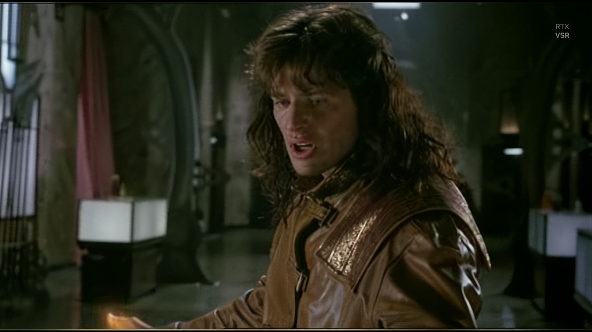
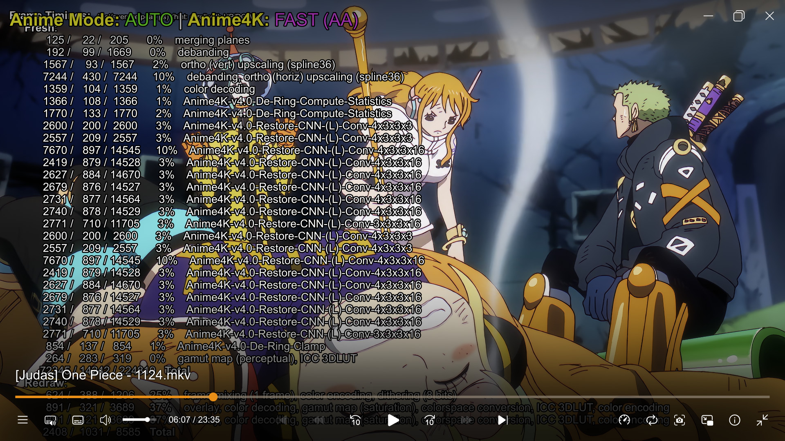
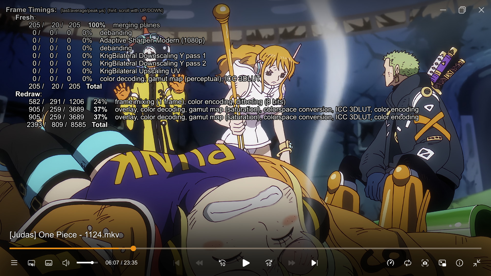
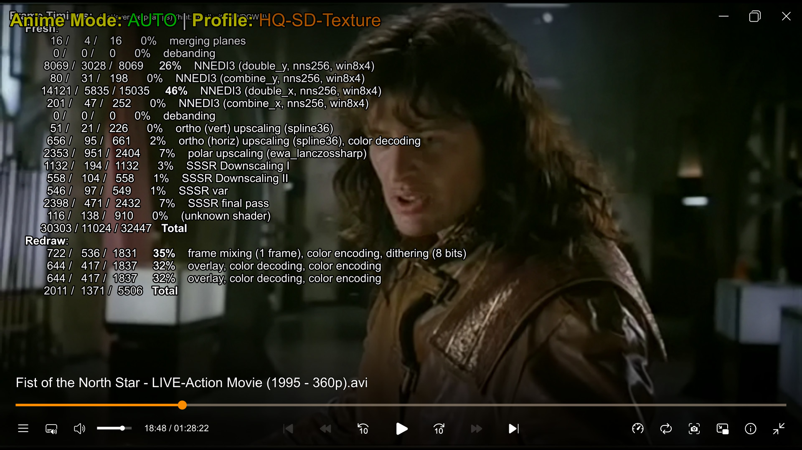
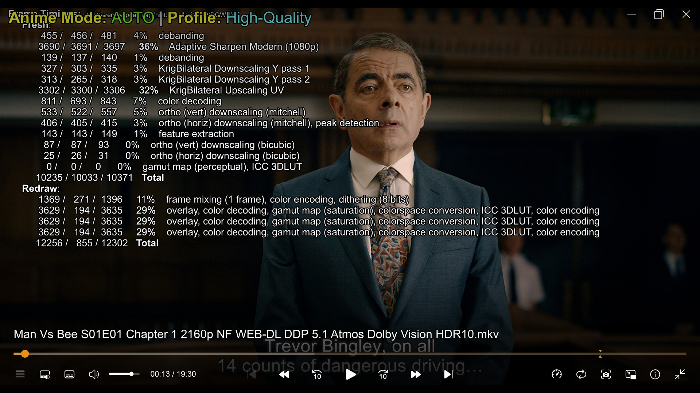
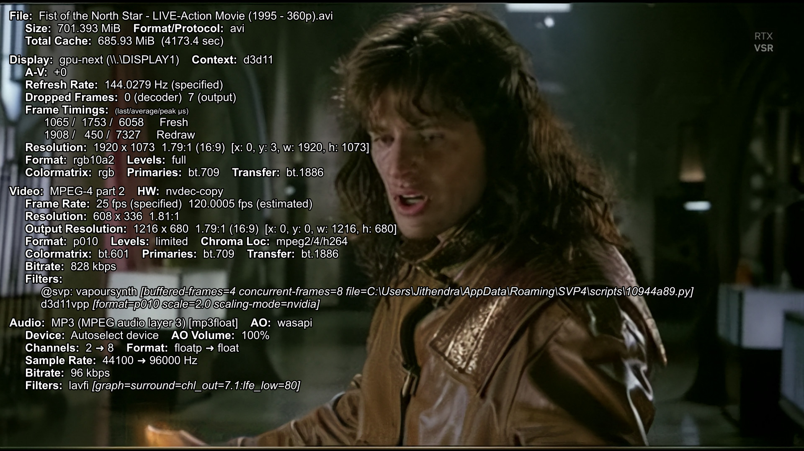
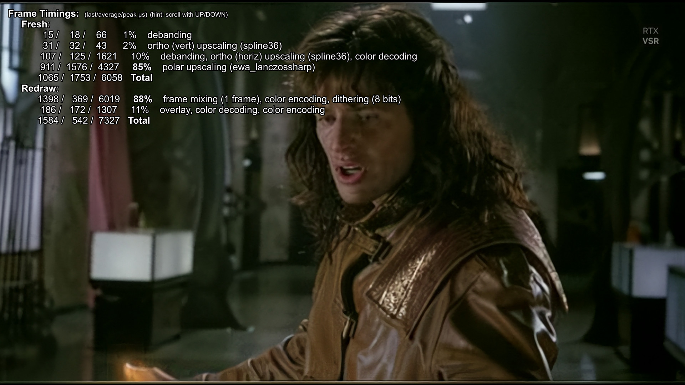

# 🎬 MPV Anime Build v1.7

> **Anime-aware MPV configuration with automatic Anime4K, Power Management, Nvidia VSR, and Universal HDR support.**

### ⚠️ Important: How Automatic Detection Works
For the auto-switching logic to function correctly, your files must follow these simple naming rules:
1.  **Anime:** The file path or folder name MUST contain the keyword **`anime`** (case-insensitive).
    * *Example:* `D:\Media\Anime\One Piece\video.mkv` -> **Activates Anime4K**
2.  **Live Action:** Any file path *without* the word 'anime' is automatically treated as Live Action.
3.  **Exceptions:** To play Live Action content located *inside* an Anime folder, the filename must contain **`live action`**, **`live-action`**, **`liveaction`**, or **`drama`**.

---

## 🌟 New in v1.7: Glass UI & True HDR

### 🎨 The "Glass" Interface (UOSC)
We have shifted from ModernZ to a fully **Customized UOSC** interface.
* **Smoked Glass Theme:** Menus, title bars, and sliders now feature a transparent design (33% opacity), ensuring the video remains visible while you navigate.
* **Centralized Control:** A new **"Anime Build Options"** menu acts as a command center, giving you instant access to Anime4K, Audio Upmix, Power Mode, and VSR without needing to remember shortcuts.

### 📺 True HDR Passthrough
The detection logic has been completely overhauled.
* **Windows HDR ON:** MPV activates **True Passthrough** (`target-colorspace-hint=yes`). It sends raw metadata directly to your display, allowing the TV to handle brightness mapping perfectly.
* **Windows HDR OFF:** MPV switches to **High-Quality Tone Mapping** (Spline) for SDR monitors.

---

## 🔋 Power Management (New in v1.6)

This build now includes a smart **Power Manager** designed for laptops.

* **Auto-Detection:** If you unplug your laptop, MPV automatically switches to a `[Low-End]` profile.
    * **Effect:** Disables high-end shaders (NNEDI3/FSRCNNX/Anime4K) and switches scaling to bilinear to save battery.
    * **Benefit:** Significantly extends battery life while watching video.
* **Auto-Restore:** Plug your laptop back in, and MPV instantly restores your previous High-Quality profile (including Anime4K or Live Action shaders).
* **Manual Toggle:** Press **`Ctrl+p`** to toggle this mode manually on any device.

### ⚠️ Important for SVP 4 Pro Users (Laptops)
The `[Low-End]` profile optimizes MPV, but **SVP 4 Pro** runs as an external background process and may try to keep working, draining your battery.

**To fix this, you MUST create a "Battery Profile" inside SVP:**

1.  Open the **SVP 4 Pro** Control Panel (system tray icon).
2.  Go to **Video Profiles**, select your main profile, and click **"New"** (Duplicate).
3.  Name it **"Battery Mode"**.
4.  **Important:** Uncheck the **"Do frame rate conversion"** box in this new profile.
5.  Click **"Add Condition"** (or "Profile conditions").
6.  Set the condition: **"Is on battery" = "Yes"**.

*Result:* Now, when you unplug your laptop, SVP will automatically stop Frame Interpolation, and MPV will automatically stop Upscaling. Total efficiency!

---

## [v1.5] – The "Universal, 4K & SVP" Update

### ⚡ Critical Optimization

* **Native 4K Logic Gate (Smart Passthrough):**
* **The Fix:** Added a robust "Logic Gate" for Native 4K (2160p) content.
* **Why:** Previous versions treated 4K video as "HD" and attempted to upscale it further to 8K using FSRCNNX, wasting massive amounts of GPU power.
* **Result:** Native 4K content now bypasses upscalers entirely (using the new `[4K-Native]` profile), ensuring crisp 1:1 playback with **zero performance penalty**.

### ✨ New Features

* **Universal Linux Support:** The build is now 100% compatible with Linux (Wayland/X11).
* **Dual-OS Config:** `mpv.conf` now automatically detects your OS. It loads `d3d11` for Windows and `vulkan` for Linux without needing manual edits.
* **Script Safety:** `vsr_auto.lua` and `hdr_detect.lua` now include OS-checks to prevent Windows-only commands (like VSR) from crashing Linux.
* **Universal Paths:** Updated all shader paths and script logic to work with both Windows (`%APPDATA%`) and Linux (`~/.config/mpv`) directory structures.

* **SVP 4 Pro Compatibility Mode:**
* **The Fix:** Enforced `hwdec=auto-copy` on Windows. This fixes the conflict where Native D3D11 decoding was locking video frames on the GPU, preventing SVP from interpolating them.
* **Result:** You can now use SVP 4 Pro (Frame Generation) and Nvidia VSR (Upscaling) simultaneously.

### 🐛 Fixed

* **Shader Syntax:** Replaced `glsl-shaders-set="..."` with `glsl-shaders-append`. This fixes a critical bug where Linux would fail to parse multiple shaders if they were separated by semicolons (`;`).
* **VSR Logic:** Updated `vsr_auto.lua` to smartly restore your previous specific shader profile (Anime vs Live Action) when disabled, instead of just resetting to default.

---

## 🌟 New in v1.4: Universal HDR & VSR

### 📺 Universal HDR/Dolby Vision Support
This build now automatically detects your monitor's capabilities via Windows.

* **For HDR/OLED TVs:** Enable **"Use HDR"** in Windows Display Settings. MPV will detect this and automatically switch to **Passthrough Mode** (sending the raw HDR signal to your TV).
* **For SDR Monitors:** Leave Windows HDR **OFF**. MPV will apply high-quality **HDR-to-SDR Tone Mapping** (Spline) to make colors look correct and vibrant on standard screens.
* **Manual Override:** Press **`H`** at any time to toggle between Passthrough (TV) and Tone Mapping (SDR) manually when playing HDR.
* **Dolby Vision:** Plays correctly on all devices. If your display does not support Dolby Vision, MPV automatically **falls back to the HDR10 Base Layer**.

### 🚀 Nvidia VSR (Manual Toggle)
Press **`V`** to toggle **Nvidia Video Super Resolution**. 

> **⚠️ Warning for Non-RTX Users:**
> This toggle is **Manual**. It forces the GPU to upscale the video using the "Nvidia-VSR" method (Windows Only).
> * **RTX 2000/3000/4000:** Activates AI Upscaling (High Quality).
> * **GTX / AMD / Intel:** Will force basic driver scaling, which often looks **worse** than MPV's default upscalers. **Do not use this unless you have an RTX card.**

---

## 🎨 Anime Mode: Stylized vs. Faithful

This build offers two distinct ways to watch anime. You can switch between them instantly using `CTRL + '` (OFF) and `CTRL + ;` (ON), or let the Auto-Detection decide.

### 1. Anime4K Mode (ON) – *The "Modern" Look*
* **Philosophy:** "Make it look like 4K."
* **Effect:** Aggressively sharpens lines, thins heavy borders, and removes noise.
* **Result:** A razor-sharp, highly stylized image that pops off the screen. Great for older anime or making 720p look like modern 4K releases.

### 2. Reference Mode (OFF) – *The "Faithful" Look*
* **Philosophy:** "Show exactly what the artist drew."
* **Effect:** Uses professional scalers (**NNEDI3** & **FSRCNNX**) to smooth lines naturally without altering the art style.
* **Result:** A smooth, cinema-quality image that preserves the original line weight, film grain, and background textures.

### 📊 Comparison Table: How They Handle Resolutions

| Resolution | Anime4K Mode (ON) | Reference / Live-Action Mode (OFF) | Best Choice For... |
| :--- | :--- | :--- | :--- |
| **SD (<576p)** *(DVDs, Old Rips)* | **Restoration Focused** Aggressively removes compression artifacts and noise. Attempts to "re-draw" jagged lines to look HD. | **Detail Focused (NNEDI3-256)** Uses deep neural networks to reconstruct missing details while preserving the original "retro" texture and grain. | **ON:** Poor quality / blocky files. **OFF:** High-quality DVD remuxes. |
| **HD (720p)** *(TV Rips, Web)* | **Upscale Focused** Sharpening is maximized to simulate a 4K resolution. Lines become very thin and crisp. | **Smoothness Focused (NNEDI3-64)** Prioritizes smooth, connected lines (anti-aliasing) over raw sharpness. No "ringing" artifacts. | **ON:** Making soft video look crisp. **OFF:** Accurate playback. |
| **FHD (1080p)** *(Blu-Ray)* | **Enhancement Focused** Adds a "digital sheen." Enhances edge contrast for a pop-out effect. | **Fidelity Focused (FSRCNNX)** Uses `KrigBilateral` to fix color bleeding and `Glaze` to add subtle cinematic grain. Reference quality. | **ON:** If you prefer the "Razor" look. **OFF:** Purists & Blu-Ray watching. |
| **4K (2160p)** *(Modern Movies)* | **Pass-through** Light processing to avoid over-sharpening already perfect video. | **Native 1:1** Bit-perfect pixel mapping. No upscaling needed. | **OFF:** Always preferred for Native 4K. |

### 💡 The "Purist" Workflow
If you want to watch anime exactly as the studio mastered it, but with better scaling than a standard player:

1.  Press **`CTRL + '`** to force **Anime Mode OFF**.
2.  Press **`Q`** to toggle your upscaler preference:
    * **NNEDI3 (Default):** Soft, natural, artifact-free lines.
    * **FSRCNNX (Sharp):** Maximum texture detail and crispness.

---

## 📸 Gallery & Visual Comparisons

### 🔹 Anime Pipeline (Automated)
Left: **Standard Playback (Red OSD)** | Right: **Anime Mode Active (Green OSD)**
*Logic detects Anime content and applies Anime4K upscaling & restoration.*

| **Live Action Mode (Anime OFF)** | **Anime Mode (Anime4K ON)** |
| :---: | :---: |
|  |  |

### 🔹 Live Action Pipeline (HD Content)
Comparison of the two high-quality upscaling engines for 720p/1080p content.

| **NNEDI3 (Auto Default)** | **FSRCNNX (Manual HQ)** |
| :---: | :---: |
|  |  |
| *Best for general viewing & speed* | *Best for maximum texture fidelity* |

### 🔹 Live Action Pipeline (SD Content)
Comparison of restoration modes for DVD-quality (<576p) content.

| **Clean Mode** | **Texture Mode** |
| :---: | :---: |
|  |  |
| *Cleans artifacts & noise* | *Preserves original film grain* |

### 🔹 Nvidia VSR (RTX AI Upscaling)
Example of RTX VSR Upscaling active on a 360p Live Action Source.

| **RTX VSR Active (Green OSD)** |
| :---: |
|  |
| *AI Upscaling via Nvidia RTX 2060* |

---

## 🤓 Technical Verification (Shaders Info)

Click below to see the active shader chains for each mode (Proof of Logic).

<b>🔻 Click to View Shader Chains</b>

### Anime Mode
| Auto (Default) | Manual Off |
| :---: | :---: |
|  |  |

### Live Action (HD)
| NNEDI3 Chain | FSRCNNX Chain |
| :---: | :---: |
|  |  |

### Live Action (SD)
| Clean Chain | Texture Chain |
| :---: | :---: |
|  |  |

### 4K Content (Native)
| 4K Native Pipeline |
| :---: |
|  |

### Nvidia VSR (Manual)
| VSR Active | Detail View |
| :---: | :---: |
|  |  |

---

## 🧪 HDR Behavior & Test Cases (v1.5)

This build features a robust **Auto-Detection System** (`hdr_detect.lua`) that changes behavior based on your monitor's capabilities. Below are the verified test results.

### 1. SDR Display Behavior
*Scenario: Windows HDR is **OFF** (Standard Monitor).*

| Video Content | MPV Action (Auto) | OSD Message | Visual Result |
| :--- | :--- | :--- | :--- |
| **SDR Video** | **Standard Mode** | *(None)* | **Normal Playback.** |
| **HDR Video** | **TONE MAPPING** | `HDR Mode: Tone Mapping` | **Correct Colors.** MPV compresses HDR colors to standard range. Image is vibrant, not washed out. |

### 2. HDR Display Behavior
*Scenario: Windows HDR is **ON** (HDR TV / OLED Monitor).*

| Video Content | MPV Action (Auto) | OSD Message | Visual Result |
| :--- | :--- | :--- | :--- |
| **SDR Video** | **Standard Mode** | *(None)* | **Normal Playback.** Windows handles the container. |
| **HDR Video** | **PASSTHROUGH** | `HDR Mode: Passthrough` | **True HDR.** Metadata is sent to the TV. Highlights are bright and correct. |

### 3. Manual Toggle ('H') Behavior
*Use the `H` (`Shift+h`) shortcut to override the auto-logic.*

| Current State | Toggle Action | Resulting Mode | What Happens? |
| :--- | :--- | :--- | :--- |
| **Any** (SDR Content) | Press `H` | **ERROR** | **Safety Block.** Prevents accidental tone-mapping of non-HDR content. |
| **Passthrough** | Press `H` | **Force TONE MAP** | **Simulated SDR.** Stops sending metadata. Useful if your TV's native HDR processing looks dark or buggy. |
| **Tone Mapping** | Press `H` | **Force PASSTHROUGH** | **Force HDR Output.**  • On HDR Screens: Activates max brightness. • On SDR Screens: **Washed Out Colors** (Grey/Foggy look). |

---

## 📌 Key Features

- 🎯 **Smart Detection:** Automatic anime vs. live-action isolation.
- 🎨 **Glass UI:** Modern, transparent **UOSC** interface with a centralized control hub.
- 🌈 **True HDR:** Automated "True Passthrough" logic with raw metadata transport.
- 🚀 **Nvidia VSR:** Smart automation with bit-depth protection (Manual Toggle: **`V`**).
- 🧠 **Logic Lockdown:** Strict resolution gates prevent profiles from firing on the wrong content.
- 🎨 **Professional OSD:** Color-coded status overlay (Green/Blue/Red).
- 🖌️ **Anime Pipeline:** Full **Anime4K** suite (Fast & HQ modes).
- 📺 **Live-Action Pipeline:** "Modern TV" style upscaling (Sony/Samsung emulation).
- 🔊 **Smart Audio:** Manual toggle for 7.1 Upmix vs. TrueHD/DTS-X Passthrough (Toggle: **`A`**).

---

## 💻 System Requirements

This build scales based on your hardware, but high-quality upscaling requires a decent GPU.

### **Minimum (1080p Playback)**
- **GPU:** NVIDIA GTX 960 / AMD RX 560 or better (2GB+ VRAM)
- **CPU:** Quad-core Intel/AMD CPU
- **RAM:** 8GB
- **Storage:** SATA SSD

### **Recommended (4K Upscaling + SVP)**
- **GPU:** NVIDIA RTX 3060 / AMD RX 6600 or better (6GB+ VRAM)
- **CPU:** Modern 6-core CPU (Ryzen 5 3600 / Intel i5-10400 or newer)
- **RAM:** 16GB
- **Storage:** NVMe SSD

---

### 🔹 Global Controls
| Shortcut | Function |
| :--- | :--- |
| `K` | **Show Profile Info** (Displays current Mode, Profile, and Active Shaders) |
| `I` | **Show Tech Stats** (Bitrate, Dropped Frames, Logic Status) |
| `A` | **Audio Mode** (Toggle between **7.1 Upmix** and **Passthrough/Bitstream**) |
| `H` | **HDR Mode** (Manual Override: Force Passthrough vs Tone Mapping) |
| `V` | **Nvidia VSR** (Toggle RTX Video Super Resolution) |
| `y` | **Cycle Sub Video Data** (None / Aspect / All) - Fixes subtitle scaling issues |

### 🔹 Anime Mode (Master Switch)
Controls whether the build treats the file as Anime or Live-Action.

| Shortcut | Mode | Description | OSD Color |
| :--- | :--- | :--- | :--- |
| `CTRL + l` | **AUTO** | Detects based on folder path & keywords (Default) | **GREEN** |
| `CTRL + ;` | **ON** | Force anime shaders for all content | **BLUE** |
| `CTRL + '` | **OFF** | Disable anime shaders completely | **RED** |

---

## 🔹 Anime Pipeline (Anime4K)

Anime4K is applied **only when anime shaders are active**. It never affects live-action files.

### 🎮 Controls
| Shortcut | Function |
| :--- | :--- |
| `L` | Toggle Anime4K **FAST** ↔ **HQ** |
| `CTRL + 1` | Mode A (Balanced) |
| `CTRL + 2` | Mode B (Soft) |
| `CTRL + 3` | Mode C (Denoise) |
| `CTRL + 4` | Mode A+A (Ultra Sharp) |
| `CTRL + 5` | Mode B+B (Ultra Soft) |
| `CTRL + 6` | Mode C+A (Denoise + Restore) |

---

## 🔹 Live-Action Pipeline

Non-anime content uses a **completely separate processing path** featuring "Modern TV" adaptive sharpening.

### Resolution Tiers (v1.5.1 Logic)
| Resolution | Profile | Technology |
| :--- | :--- | :--- |
| **< 576p** | `HQ-SD` | **NNEDI3-256** (Max Quality) or **FSRCNNX** (Sharp Mode) |
| **576p – <1080p** | `HQ-HD` | **NNEDI3-64** (Balanced) or **FSRCNNX** (Sharp Mode) |
| **≥ 1080p** | `High-Quality` | Native + Adaptive Sharpen + Glaze (Film Grain) |

### 🎮 Controls
| Shortcut | Context | Function |
| :--- | :--- | :--- |
| `CTRL + q` | **SD Only** | Toggle **Clean** ↔ **Texture** mode.  *(Only works in NNEDI3 mode. Locked if FSRCNNX is active)* |
| `Q` | **SD & HD** | **Master Upscaler Toggle** (NNEDI3 ↔ FSRCNNX).  *(Switches logic between Geometry-focused and Texture-focused upscaling for both SD and HD)* |

> **Note:** The shortcuts are **smart**. `CTRL+Q` will automatically lock itself if you are using the Sharp (FSRCNNX) mode to prevent logic conflicts.

---

## 🔧 Installation

1. **Install MPV:** Download the latest 64-bit version of MPV (shinchiro builds recommended).
2. **Install SVP 4 Pro:** (Optional) Ensure SVP is installed and running if you want motion interpolation.
3. **Copy Files:** Extract the contents of this build into your `%APPDATA%/mpv/` folder.
4. **Font Installation:** Install `Source Sans Pro` (included) to ensure the Stats overlay renders correctly.

## 📝 Credits
- **Anime4K:** bloc97
- **UOSC Skin:** tomasklaen
- **Thumbfast:** po5
- **Shaders:** bloc97 (Anime4K), igv (FSRCNNX), bjin (KrigBilateral),
- **Config & Logic:** Customized and built for MPV Anime Build by Chinna95P