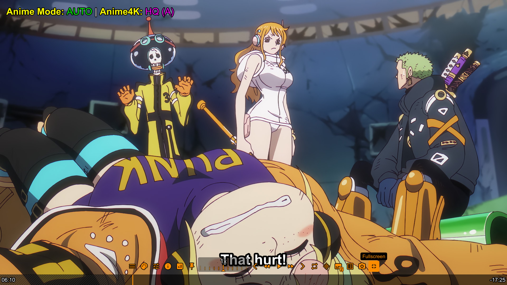
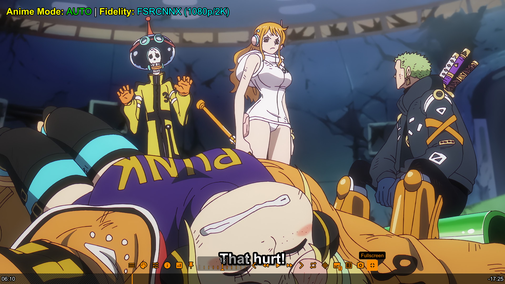
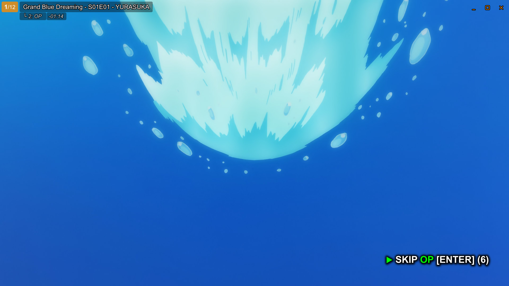
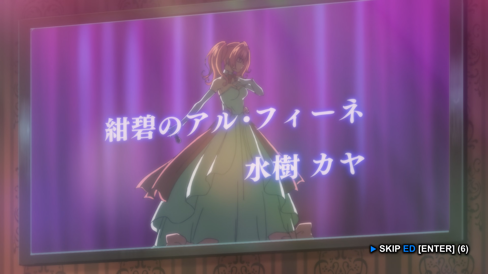
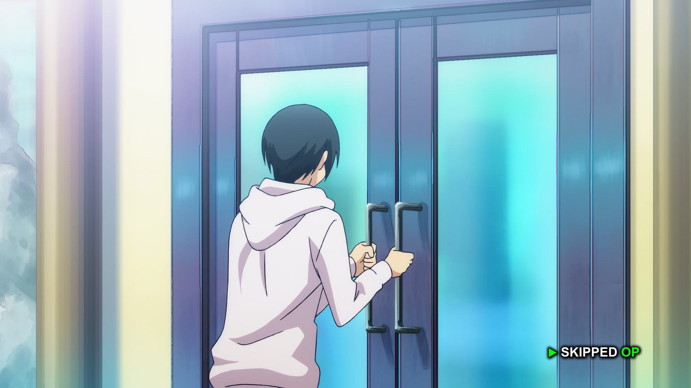
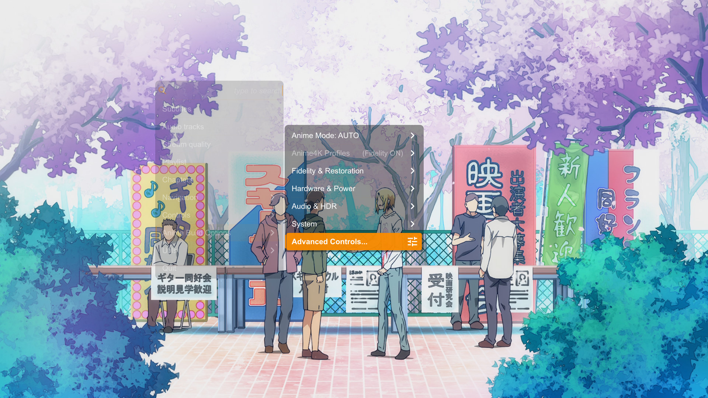
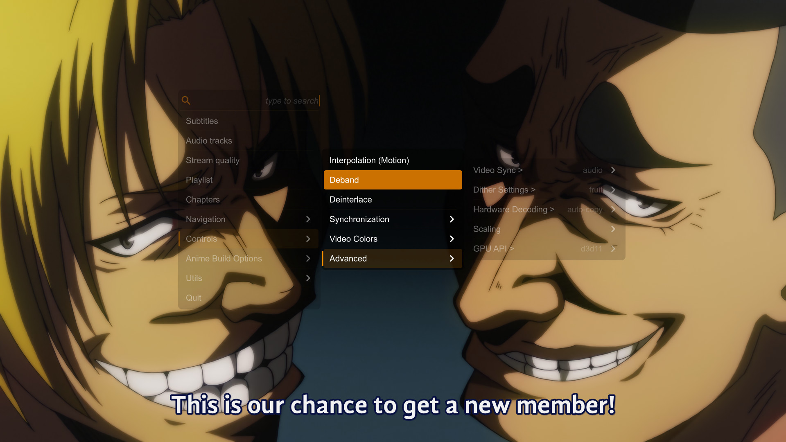

# 🎬 MPV Anime Build v1.9.6

> **Anime-aware MPV configuration with automatic Anime Fidelity, Power Management, Nvidia VSR, and Universal HDR support.**

### ⚠️ Important: How Automatic Detection Works
For the auto-switching logic to function correctly, your files must follow these simple naming rules:
1.  **Anime:** The file path or folder name MUST contain the keyword **`anime`** (case-insensitive).
    * *Example:* `D:\Media\Anime\One Piece\video.mkv` -> **Activates Anime4K**
2.  **Live Action:** Any file path *without* the word 'anime' is automatically treated as Live Action.
3.  **Exceptions:** To play Live Action content located *inside* an Anime folder, the filename must contain **`live action`**, **`live-action`**, **`liveaction`**, or **`drama`**.

---

## [v1.9.6] – The "Scaling" Controls Update

### ✨ New Features
* **Expanded Scaling Menu:**
    * **New Downscalers:** Added **`spline64`** and **`lanczos`** to the "Scaling" Section in Controls Menu.
    * **Use Case:** Allows users playing 4K content on 1080p screens to match the sharp, high-quality downscaling.
    * **New Upscalers:** Added **`spline64`** and **`lanczos`** as manual alternatives to the default `ewa_lanczossharp`.
    * **Chroma Scalers:** Added **`spline64`** and **`lanczos`** to the "Chromascale" menu for users who want maximum color precision.

### ⚡ Improvements
* **Menu Completeness:** The "Controls" -> "Scaling" menu now features the full "Hall of Fame" of MPV native scalers, giving users total control over sharpness vs. ringing artifacts:
    * **Sharp:** `ewa_lanczossharp`, `spline64`, `lanczos`
    * **Balanced:** `spline36`
    * **Soft:** `mitchell`, `hermite`

---

## 🎛️ Native Scalers Guide (Manual Controls)

While this build uses AI Shaders (Anime4K, FSRCNNX) by default, the **Controls Menu** allows you to manually override the scaling engine for specific scenarios.

| Scaler | Sharpness | Ringing (Artifacts) | Best Use Case |
| :--- | :--- | :--- | :--- |
| **ewa_lanczossharp** | ⭐⭐⭐⭐ | 📉 Low | **Best General Upscaler.** The "Gold Standard" for MPV. Sharp but clean. Default for non-AI upscaling. |
| **spline64** | ⭐⭐⭐⭐⭐ | 📈 Medium | **Best Downscaler.** Retains maximum texture when watching 4K content on 1080p screens. |
| **lanczos** | ⭐⭐⭐⭐⭐ | 📈 High | **Classic Sharp.** Very crisp, but can create visible halos around dark lines. Use if you love a "crunchy" image. |
| **spline36** | ⭐⭐⭐ | 📉 Low | **Best Chroma Scaler.** The perfect balance for color resizing. High quality, zero visual artifacts, and fast. |
| **mitchell** | ⭐ | ⛔ None | **Smooth.** A soft scaler that hides compression artifacts. Good for downscaling if you hate aliasing/flicker. |
| **bilinear** | 🌑 | ⛔ None | **Emergency Only.** Blurry but extremely fast. Only use if your GPU is overheating or struggling. |

> **Pro Tip:** For the Best Quality, set your **Downscaler** to `spline64` and your **Upscaler** to `ewa_lanczossharp`.

---

## ✨ Key Features (v1.9.5)

### 1. Smart OSD Separation
We have decluttered the interface by separating system status messages.
* **Top-Left:** Displays Power Mode and Anime Profile status.
* **Top-Right:** Displays **Nvidia VSR** status and active video filters.
* **Benefit:** No more overlapping text when multiple features activate at once.

### 2. "Silent Partner" Logic
The build now intelligently manages OSD announcements during power events.
* **Battery/AC Swap:** When you unplug or plug in your laptop, the Power Manager handles the announcement. Other scripts (like VSR) update their state silently in the background to prevent screen spam.

### 3. Stability Hardening
* **Race Condition Fix:** Eliminated the "double-scaling" glitch that could occur when restoring AC power. The system now waits for the GPU to fully wake up before applying high-end shaders.
* **Logic Locks:** The Anime Controller now strictly respects the VSR engine, ensuring it never attempts to override AI upscaling with standard shaders.

---

## ✨ Key Features (v1.9.4)

### 1. Adaptive Nvidia VSR
We have upgraded the RTX VSR implementation to be **Resolution Aware**.
* **Old Behavior:** Always scaled 2.0x (wasting power on 1080p screens, or under-scaling on 4K).
* **New Behavior:** Calculates the perfect pixel ratio.
    * *Example:* Playing 720p content on a 4K Screen? -> **VSR Scales 3.0x**.
    * *Example:* Playing 1080p content on a 1080p Screen? -> **VSR Scales 1.0x (Native)**.

### 2. Logic Lockdown (Power Safety)
The build now actively protects your battery. If **Power Saving Mode** is active (Auto or Manual), the build strictly **locks** you out of high-performance features.
* **Locked:** Anime4K, Fidelity Mode, NNEDI3/FSRCNNX Toggles, and RTX VSR.
* **Visuals:** The OSD and Stats Overlay will explicitly report **"⚡Power Saving Mode"** and block accidental inputs with a Red warning.

### 3. Master Shader Persistence (`CTRL+g`)
We have added a "Kill Switch" for all post-processing.
* **What it does:** Pressing **`CTRL+g`** instantly disables **ALL** shaders (Anime4K, FSRCNNX, NNEDI3, Adaptive Sharpen, etc.), returning MPV to its raw, native state.
* **Persistence:** This setting is now **saved**. If you turn shaders OFF, MPV will launch with shaders disabled next time.
* **Use Case:** Perfect for checking "Before/After" quality comparisons, or for purists who want to watch specific content without any processing.

---

## ✨ Key Features (v1.9.3)

### 1. Universal Persistence
We have completed the memory system. The build now remembers **ALL** your preferences across restarts:
* **Anime:** Remembers if you prefer **Fidelity** (FSRCNNX) or **Performance** (Anime4K).
* **Live Action:** Remembers if you prefer **NNEDI3** (Smooth) or **FSRCNNX** (Sharp) for HD content.
* **SD Content:** Remembers your **Clean** vs **Texture** preference.
* **HDR:** Remembers your **Tone-Mapping** algorithm and **Target Peak**.

---

## ✨ Key Features (v1.9.1)

### 1. Professional HDR Calibration
(New in v1.9.1) We have unlocked MPV's internal tone-mapping engine. Instead of a generic "Auto" setting, you can now fine-tune HDR processing:

* **Algorithms:** Select from **BT.2390** (Recommended), **ST.2094-40** (Active Contrast), **BT.2446a** (Static Color), or legacy curves like **Reinhard**.
* **Target Peak:** Manually tell MPV your screen's brightness (e.g., 400 nits, 600 nits) to prevent crushed blacks or blown-out highlights.

## ✨ Key Features (v1.9)

### 1. Anime Fidelity Mode vs. Performance
You now have two distinct engines for watching Anime. Switch between them instantly via the menu.

| Mode | Engine | Best For | Logic |
| :--- | :--- | :--- | :--- |
| **Performance (Default)** | **Anime4K** | **720p / Old Anime** | Aggressive upscaling, artifact removal, and "painting" effect. Best for low-bitrate streams. |
| **Fidelity (New)** | **FSRCNNX** | **1080p / Modern Anime** | Preserves original texture and line art. Uses distinct networks based on resolution. |

**How Fidelity Mode adapts to Resolution:**
* **SD Content:** Applies `FSRCNNX-16 (Anime Enhance)` for deep reconstruction.
* **HD/FHD Content:** Applies `FSRCNNX-8 (Line Art)` for subtle edge refinement without destroying the artist's original texture.
* **4K Content:** Applies `Adaptive Sharpen` only.

| Anime4K (Art Style) | Fidelity (Purist) |
| :---: | :---: |
|  |  |

### 2. "Neon Glass" Stats Overlay
Press `CTRL+i` to see exactly what your build is doing.
* **Real-time Shader Tracking:** See if you are running NNEDI3, FSRCNNX, or Anime4K.
* **Audio Logic:** Check if 7.1 Upmix or Night Mode is active.
* **HDR Status:** Instant confirmation of Tone-Mapping vs Passthrough.
* **Safe Alignment:** Uses a virtual 720p canvas to ensure pixel-perfect display on 1080p, 1440p, and 4K screens.

## 🌙 Night Mode (New in v1.9)

Watching late at night? Toggle **Night Mode** to normalize audio volume.

* **What it does:** Applies Dynamic Range Compression (DRC).
* **Effect:** Loud sounds (explosions, openings) are lowered, and quiet sounds (whispers, footsteps) are boosted.
* **Toggle:** Open the **Audio & HDR** menu and click the 'Audio Night Mode'.

---

## ⏩ Smart Skip Intro (New in v1.8)

This build now features an intelligent **Skip Intro** button that appears automatically when a chapter starts.

### How it Works
The build reads chapter titles and categorizes them to give you context-aware options:

| Content Type | Button Label | Color Indicator | Meaning |
| :--- | :--- | :--- | :--- |
| **Opening** | `SKIP OP` | 🟢 **Green** | "Start the episode" |
| **Ending** | `SKIP ED` | 🔵 **Blue** | "Finish the episode" |
| **Preview** | `SKIP PV` | 🟣 **Magenta** | "Skip spoilers" |
| **Intro** | `SKIP INTRO` | 🟠 **Orange** | "Generic Skip" |

| OP Detected | ED Detected | Feedback |
| :---: | :---: | :---: |
|  |  |  |

### 🎮 Controls
* **Click:** Simply click the button with your mouse.
* **Keyboard:** Press **`ENTER`** to skip.
* **Smart Pause:** If you pause the video, the skip timer pauses too. It waits for you.

### ⚙️ Activation Requirements
The button **only** appears if your video file contains **Chapters** with specific keywords in their titles. The build automatically scans for these terms:

* **OP / Opening:** `OP`, `Opening`, `Theme`, `Song`
* **ED / Ending:** `ED`, `Ending`, `Credits`
* **PV / Preview:** `PV`, `Preview`
* **Intro:** `Intro`

> **Note:** If your file does not have chapters (or chapters are named generically like "Chapter 1"), the button will not appear.

---

### 🎮 The "Controls" Dashboard (v1.7.1)
We have added a dedicated **Controls Button** (Tune/Sliders icon) to the main **Control Bar** (above the timeline).
* **Instant Access:** Adjust Audio/Subtitle Sync, Interpolation, Colors, and Shaders with a single click.
* **Advanced Tools:** Includes deep settings for Hardware Decoding, Dither, and Video Sync modes.
* **Smart Memory:** The menu remembers your cursor position, allowing for rapid-fire adjustments without the mouse jumping around.

---

## 🌟 New in v1.7: Glass UI & True HDR

### 🎨 The "Glass" Interface (UOSC)
We have shifted from ModernZ to a fully **Customized UOSC** interface.
* **Smoked Glass Theme:** Menus, title bars, and sliders now feature a transparent design (33% opacity), ensuring the video remains visible while you navigate.
* **Centralized Control:** A new **"Anime Build Options"** menu acts as a command center, giving you instant access to Anime4K, Audio Upmix, Power Mode, and VSR without needing to remember shortcuts.

| Main Menu | Advanced Controls |
| :---: | :---: |
|  |  |

### 📺 True HDR Passthrough
The detection logic has been completely overhauled.
* **Windows HDR ON:** MPV activates **True Passthrough** (`target-colorspace-hint=yes`). It sends raw metadata directly to your display, allowing the TV to handle brightness mapping perfectly.
* **Windows HDR OFF:** MPV switches to **High-Quality Tone Mapping** (Spline) for SDR monitors.

---

## 🔋 Power Management (New in v1.6)

This build now includes a smart **Power Manager** designed for laptops.

* **Auto-Detection:** If you unplug your laptop, MPV automatically switches to a `[Low-End]` profile.
    * **Effect:** Disables high-end shaders (NNEDI3/FSRCNNX/Anime4K) and switches scaling to bilinear to save battery.
    * **Benefit:** Significantly extends battery life while watching video.
* **Auto-Restore:** Plug your laptop back in, and MPV instantly restores your previous High-Quality profile (including Anime4K or Live Action shaders).
* **Manual Toggle:** Press **`Ctrl+p`** to toggle this mode manually on any device.

* **Feature Lockdown (v1.9.4):** While in Low Power Mode, the build actively prevents you from accidentally turning on heavy shaders. Toggles for Anime4K, Fidelity, and VSR will show a **"Locked: Power Saving Mode Active"** warning.

### ⚠️ Important for SVP 4 Pro Users (Laptops)
The `[Low-End]` profile optimizes MPV, but **SVP 4 Pro** runs as an external background process and may try to keep working, draining your battery.

**To fix this, you MUST create a "Battery Profile" inside SVP:**

1.  Open the **SVP 4 Pro** Control Panel (system tray icon).
2.  Go to **Video Profiles**, select your main profile, and click **"New"** (Duplicate).
3.  Name it **"Battery Mode"**.
4.  **Important:** Uncheck the **"Do frame rate conversion"** box in this new profile.
5.  Click **"Add Condition"** (or "Profile conditions").
6.  Set the condition: **"Is on battery" = "Yes"**.

*Result:* Now, when you unplug your laptop, SVP will automatically stop Frame Interpolation, and MPV will automatically stop Upscaling. Total efficiency!

---

## [v1.5] – The "Universal, 4K & SVP" Update

### ⚡ Critical Optimization

* **Native 4K Logic Gate (Smart Passthrough):**
* **The Fix:** Added a robust "Logic Gate" for Native 4K (2160p) content.
* **Why:** Previous versions treated 4K video as "HD" and attempted to upscale it further to 8K using FSRCNNX, wasting massive amounts of GPU power.
* **Result:** Native 4K content now bypasses upscalers entirely (using the new `[4K-Native]` profile), ensuring crisp 1:1 playback with **zero performance penalty**.

### ✨ New Features

* **Universal Linux Support:** The build is now 100% compatible with Linux (Wayland/X11).
* **Dual-OS Config:** `mpv.conf` now automatically detects your OS. It loads `d3d11` for Windows and `vulkan` for Linux without needing manual edits.
* **Script Safety:** `vsr_auto.lua` and `hdr_detect.lua` now include OS-checks to prevent Windows-only commands (like VSR) from crashing Linux.
* **Universal Paths:** Updated all shader paths and script logic to work with both Windows (`%APPDATA%`) and Linux (`~/.config/mpv`) directory structures.

* **SVP 4 Pro Compatibility Mode:**
* **The Fix:** Enforced `hwdec=auto-copy` on Windows. This fixes the conflict where Native D3D11 decoding was locking video frames on the GPU, preventing SVP from interpolating them.
* **Result:** You can now use SVP 4 Pro (Frame Generation) and Nvidia VSR (Upscaling) simultaneously.

### 🐛 Fixed

* **Shader Syntax:** Replaced `glsl-shaders-set="..."` with `glsl-shaders-append`. This fixes a critical bug where Linux would fail to parse multiple shaders if they were separated by semicolons (`;`).
* **VSR Logic:** Updated `vsr_auto.lua` to smartly restore your previous specific shader profile (Anime vs Live Action) when disabled, instead of just resetting to default.

---

## 🌟 New in v1.4: Universal HDR & VSR

### 📺 Universal HDR/Dolby Vision Support
This build now automatically detects your monitor's capabilities via Windows.

* **For HDR/OLED TVs:** Enable **"Use HDR"** in Windows Display Settings. MPV will detect this and automatically switch to **Passthrough Mode** (sending the raw HDR signal to your TV).
* **For SDR Monitors:** Leave Windows HDR **OFF**. MPV will apply high-quality **HDR-to-SDR Tone Mapping** (Spline) to make colors look correct and vibrant on standard screens.
* **Manual Override:** Press **`H`** at any time to toggle between Passthrough (TV) and Tone Mapping (SDR) manually when playing HDR.
* **Dolby Vision:** Plays correctly on all devices. If your display does not support Dolby Vision, MPV automatically **falls back to the HDR10 Base Layer**.

### 🚀 Nvidia VSR (Adaptive AI Upscaling)
Press **`V`** to toggle **Nvidia Video Super Resolution** (only works for Windows Users).

> **⚠️ Warning for Non-RTX Users:**
> This feature requires an **Nvidia RTX 2000/3000/4000 series** GPU. Do not use on Intel/AMD.

**How it works (v1.9.4):**
This is no longer a dumb toggle. The script now analyzes your **Monitor Resolution** vs. **Video Resolution**.
* **Smart Ratio:** It applies the exact scale factor needed to fill your screen (e.g., 1.5x, 2.25x).
* **Power Efficient:** It won't waste GPU power rendering pixels you can't see (e.g., won't render 4K internal resolution if you only have a 1080p monitor).
* **Bit-Depth Safe:** Automatically selects `p010` (10-bit) for HDR/Anime to prevent banding.

---

## 🎨 Anime Mode: Stylized vs. Faithful

This build offers two distinct ways to watch anime. You can switch between them instantly using `CTRL + '` (OFF) and `CTRL + ;` (ON), or let the Auto-Detection decide.

### 1. Anime4K Mode (ON) – *The "Modern" Look*
* **Philosophy:** "Make it look like 4K."
* **Effect:** Aggressively sharpens lines, thins heavy borders, and removes noise.
* **Result:** A razor-sharp, highly stylized image that pops off the screen. Great for older anime or making 720p look like modern 4K releases.

### 2. Reference Mode (OFF) – *The "Faithful" Look*
* **Philosophy:** "Show exactly what the artist drew."
* **Effect:** Uses professional scalers (**NNEDI3** & **FSRCNNX**) to smooth lines naturally without altering the art style.
* **Result:** A smooth, cinema-quality image that preserves the original line weight, film grain, and background textures.

### 📊 Comparison Table: How They Handle Resolutions

| Resolution | Anime4K Mode (ON) | Reference / Live-Action Mode (OFF) | Best Choice For... |
| :--- | :--- | :--- | :--- |
| **SD (<576p)** *(DVDs, Old Rips)* | **Restoration Focused** Aggressively removes compression artifacts and noise. Attempts to "re-draw" jagged lines to look HD. | **Detail Focused (NNEDI3-256)** Uses deep neural networks to reconstruct missing details while preserving the original "retro" texture and grain. | **ON:** Poor quality / blocky files. **OFF:** High-quality DVD remuxes. |
| **HD (720p)** *(TV Rips, Web)* | **Upscale Focused** Sharpening is maximized to simulate a 4K resolution. Lines become very thin and crisp. | **Smoothness Focused (NNEDI3-64)** Prioritizes smooth, connected lines (anti-aliasing) over raw sharpness. No "ringing" artifacts. | **ON:** Making soft video look crisp. **OFF:** Accurate playback. |
| **FHD (1080p)** *(Blu-Ray)* | **Enhancement Focused** Adds a "digital sheen." Enhances edge contrast for a pop-out effect. | **Fidelity Focused (FSRCNNX)** Uses `KrigBilateral` to fix color bleeding and `Glaze` to add subtle cinematic grain. Reference quality. | **ON:** If you prefer the "Razor" look. **OFF:** Purists & Blu-Ray watching. |
| **4K (2160p)** *(Modern Movies)* | **Pass-through** Light processing to avoid over-sharpening already perfect video. | **Native 1:1** Bit-perfect pixel mapping. No upscaling needed. | **OFF:** Always preferred for Native 4K. |

### 💡 The "Purist" Workflow
If you want to watch anime exactly as the studio mastered it, but with better scaling than a standard player:

1.  Press **`CTRL + '`** to force **Anime Mode OFF**.
2.  Press **`Q`** to toggle your upscaler preference:
    * **NNEDI3 (Default):** Soft, natural, artifact-free lines.
    * **FSRCNNX (Sharp):** Maximum texture detail and crispness.

---

## 📸 Gallery & Visual Comparisons

### 🔹 Anime Pipeline (Automated)
Left: **Standard Playback (Red OSD)** | Right: **Anime Mode Active (Green OSD)**
*Logic detects Anime content and applies Anime4K upscaling & restoration.*

| **Live Action Mode (Anime OFF)** | **Anime Mode (Anime4K ON)** |
| :---: | :---: |
|  |  |

### 🔹 Live Action Pipeline (HD Content)
Comparison of the two high-quality upscaling engines for 720p/1080p content.

| **NNEDI3 (Auto Default)** | **FSRCNNX (Manual HQ)** |
| :---: | :---: |
|  |  |
| *Best for general viewing & speed* | *Best for maximum texture fidelity* |

### 🔹 Live Action Pipeline (SD Content)
Comparison of restoration modes for DVD-quality (<576p) content.

| **Clean Mode** | **Texture Mode** |
| :---: | :---: |
|  |  |
| *Cleans artifacts & noise* | *Preserves original film grain* |

### 🔹 Nvidia VSR (RTX AI Upscaling)
Example of RTX VSR Upscaling active on a 360p Live Action Source.

| **RTX VSR Active (Green OSD)** |
| :---: |
|  |
| *AI Upscaling via Nvidia RTX 2060* |

---

## 🤓 Technical Verification (Shaders Info)

Click below to see the active shader chains for each mode (Proof of Logic).

<b>🔻 Click to View Shader Chains</b>

### Anime Mode
| Auto (Default) | Manual Off |
| :---: | :---: |
|  |  |

### Live Action (HD)
| NNEDI3 Chain | FSRCNNX Chain |
| :---: | :---: |
|  |  |

### Live Action (SD)
| Clean Chain | Texture Chain |
| :---: | :---: |
|  |  |

### 4K Content (Native)
| 4K Native Pipeline |
| :---: |
|  |

### Nvidia VSR (Manual)
| VSR Active | Detail View |
| :---: | :---: |
|  |  |

---

## 🧪 HDR Behavior & Test Cases (v1.5)

This build features a robust **Auto-Detection System** (`hdr_detect.lua`) that changes behavior based on your monitor's capabilities. Below are the verified test results.

### 1. SDR Display Behavior
*Scenario: Windows HDR is **OFF** (Standard Monitor).*

| Video Content | MPV Action (Auto) | OSD Message | Visual Result |
| :--- | :--- | :--- | :--- |
| **SDR Video** | **Standard Mode** | *(None)* | **Normal Playback.** |
| **HDR Video** | **TONE MAPPING** | `HDR Mode: Tone Mapping` | **Correct Colors.** MPV compresses HDR colors to standard range. Image is vibrant, not washed out. |

### 2. HDR Display Behavior
*Scenario: Windows HDR is **ON** (HDR TV / OLED Monitor).*

| Video Content | MPV Action (Auto) | OSD Message | Visual Result |
| :--- | :--- | :--- | :--- |
| **SDR Video** | **Standard Mode** | *(None)* | **Normal Playback.** Windows handles the container. |
| **HDR Video** | **PASSTHROUGH** | `HDR Mode: Passthrough` | **True HDR.** Metadata is sent to the TV. Highlights are bright and correct. |

### 3. Manual Toggle ('H') Behavior
*Use the `H` (`Shift+h`) shortcut to override the auto-logic.*

| Current State | Toggle Action | Resulting Mode | What Happens? |
| :--- | :--- | :--- | :--- |
| **Any** (SDR Content) | Press `H` | **ERROR** | **Safety Block.** Prevents accidental tone-mapping of non-HDR content. |
| **Passthrough** | Press `H` | **Force TONE MAP** | **Simulated SDR.** Stops sending metadata. Useful if your TV's native HDR processing looks dark or buggy. |
| **Tone Mapping** | Press `H` | **Force PASSTHROUGH** | **Force HDR Output.**  • On HDR Screens: Activates max brightness. • On SDR Screens: **Washed Out Colors** (Grey/Foggy look). |

---

## 📌 Key Features

- 🎯 **Smart Detection:** Automatic anime vs. live-action isolation.
- 🎨 **Glass UI:** Modern, transparent **UOSC** interface with a centralized control hub.
- 🌈 **True HDR:** Automated "True Passthrough" logic with raw metadata transport.
- 🚀 **Nvidia VSR:** Smart automation with bit-depth protection (Manual Toggle: **`V`**).
- 🧠 **Logic Lockdown:** Strict resolution gates prevent profiles from firing on the wrong content.
- 🎨 **Professional OSD:** Color-coded status overlay (Green/Blue/Red).
- 🖌️ **Anime Pipeline:** Full **Anime4K** suite (Fast & HQ modes).
- 📺 **Live-Action Pipeline:** "Modern TV" style upscaling (Sony/Samsung emulation).
- 🔊 **Smart Audio:** Manual toggle for 7.1 Upmix vs. TrueHD/DTS-X Passthrough (Toggle: **`A`**).

---

## 💻 System Requirements

This build scales based on your hardware, but high-quality upscaling requires a decent GPU.

### **Minimum (1080p Playback)**
- **GPU:** NVIDIA GTX 960 / AMD RX 560 or better (2GB+ VRAM)
- **CPU:** Quad-core Intel/AMD CPU
- **RAM:** 8GB
- **Storage:** SATA SSD

### **Recommended (4K Upscaling + SVP)**
- **GPU:** NVIDIA RTX 3060 / AMD RX 6600 or better (6GB+ VRAM)
- **CPU:** Modern 6-core CPU (Ryzen 5 3600 / Intel i5-10400 or newer)
- **RAM:** 16GB
- **Storage:** NVMe SSD

---

### 🔹 Global Controls
| Shortcut | Function |
| :--- | :--- |
| `K` | **Show Profile Info** (Displays current Mode, Profile, and Active Shaders) |
| `I` | **Show Tech Stats** (Bitrate, Dropped Frames, Logic Status) |
| `A` | **Audio Mode** (Toggle between **7.1 Upmix** and **Passthrough/Bitstream**) |
| `H` | **HDR Mode** (Manual Override: Force Passthrough vs Tone Mapping) |
| `V` | **Nvidia VSR** (Toggle RTX Video Super Resolution) |
| `y` | **Cycle Sub Video Data** (None / Aspect / All) - Fixes subtitle scaling issues |

### 🔹 Anime Mode (Master Switch)
Controls whether the build treats the file as Anime or Live-Action.

| Shortcut | Mode | Description | OSD Color |
| :--- | :--- | :--- | :--- |
| `CTRL + l` | **AUTO** | Detects based on folder path & keywords (Default) | **GREEN** |
| `CTRL + ;` | **ON** | Force anime shaders for all content | **BLUE** |
| `CTRL + '` | **OFF** | Disable anime shaders completely | **RED** |

---

## 🔹 Anime Pipeline (Anime4K)

Anime4K is applied **only when anime shaders are active**. It never affects live-action files.

### 🎮 Controls
| Shortcut | Function |
| :--- | :--- |
| `L` | Toggle Anime4K **FAST** ↔ **HQ** |
| `CTRL + 1` | Mode A (Balanced) |
| `CTRL + 2` | Mode B (Soft) |
| `CTRL + 3` | Mode C (Denoise) |
| `CTRL + 4` | Mode A+A (Ultra Sharp) |
| `CTRL + 5` | Mode B+B (Ultra Soft) |
| `CTRL + 6` | Mode C+A (Denoise + Restore) |

---

## 🔹 Live-Action Pipeline

Non-anime content uses a **completely separate processing path** featuring "Modern TV" adaptive sharpening.

### Resolution Tiers (v1.9.3 Logic)
| Resolution | Profile | Technology |
| :--- | :--- | :--- |
| **< 576p** | `HQ-SD` | **NNEDI3-256** (Max Quality) or **FSRCNNX** (Sharp Mode) |
| **576p – <1080p** | `HQ-HD` | **NNEDI3-64** (Balanced) or **FSRCNNX** (Sharp Mode) |
| **≥ 1080p** | `High-Quality` | Native + Adaptive Sharpen + Glaze (Film Grain) |

### 🎮 Controls
| Shortcut | Context | Function |
| :--- | :--- | :--- |
| `CTRL + q` | **SD Only** | Toggle **Clean** ↔ **Texture** mode.  *(Only works in NNEDI3 mode. Locked if FSRCNNX is active)* |
| `Q` | **SD & HD** | **Master Upscaler Toggle** (NNEDI3 ↔ FSRCNNX).  *(Switches logic between Geometry-focused and Texture-focused upscaling for both SD and HD)* |

> **Note (v1.9.3):** Your choices for `Q` and `CTRL+Q` are now **Persistent**. If you set HD content to use FSRCNNX, MPV will remember that setting for the next time you open a file.> **Note:** The shortcuts are **smart**. `CTRL+Q` will automatically lock itself if you are using the Sharp (FSRCNNX) mode to prevent logic conflicts.

---

## 🔧 Installation

1. **Install MPV:** Download the latest 64-bit version of MPV (shinchiro builds recommended).
2. **Install SVP 4 Pro:** (Optional) Ensure SVP is installed and running if you want motion interpolation.
3. **Copy Files:** Extract the contents of this build into your `%APPDATA%/mpv/` folder.
4. **Font Installation:** Install `Source Sans Pro` (included) to ensure the Stats overlay renders correctly.

## 📝 Credits
- **Anime4K:** bloc97
- **UOSC Skin:** tomasklaen
- **Thumbfast:** po5
- **Shaders:** bloc97 (Anime4K), igv (FSRCNNX), bjin (KrigBilateral),
- **Config & Logic:** Customized and built for MPV Anime Build by Chinna95P