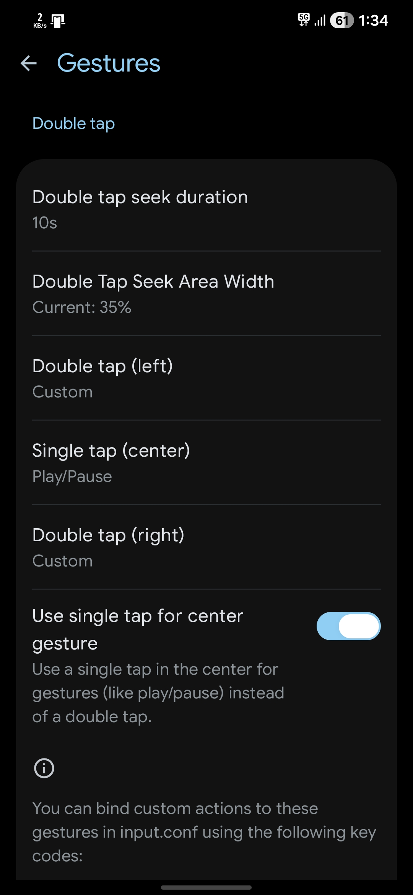

# 📱 MPV Android Anime Build (mpvEX Optimized)

An advanced configuration for **mpv-android (mpvEX)** that brings high-end PC features to mobile:
* **Auto-Detection:** Automatically switches profiles for Anime vs. Live Action.
* **Smart Shaders:** Prioritizes Built-in Anime4K (App) or Custom FSRCNNX (Config) intelligently.
* **Spatial Audio:** Virtual Surround Sound for headphones.
* **Gesture UI:** "Double Tap to Skip Intro" with visual feedback.

.jpg)
.jpg)

## 📥 Installation

1.  **Download Files:** Switch to the `android` branch and download the ZIP.
2.  **Locate MPV Folder:** On your phone, go to `/storage/emulated/0/mpv/` (or create it).
3.  **Copy:** **Extract ALL files directly into this folder.**
    * Do NOT create `scripts` or `shaders` subfolders.
    * All `.lua`, `.glsl`, `.conf` files must sit together in the main `mpv` folder.

## ⚙️ Critical Setup (Do not skip!)

### 1. Enable Storage Permissions
For the shaders to load, **mpvEX** needs full storage access.
* *Android Settings > Apps > mpvEX > Permissions > Files > **Allow all time/Management**.*

### 2. Activate Config (Important):
* Open **mpvEX** and go to **Settings** -> **Advanced**.
* Tap **Pick Configuration Storage location**.
* Select the folder where you extracted the files (e.g., `mpv`) and tap **USE THIS FOLDER** -> **ALLOW**.
* In the same menu, check **Enable Lua scripts**.
* Tap **Manage Lua scripts** and ensure all scripts (`anime_auto_detect.lua`, `skip_intro.lua`) are ticked.

### 3. Configure Gestures (Required for Skip Intro)
The skip intro script relies on the App's native gesture system to bypass Android touch limitations.

1.  Open **mpvEX Settings > Controls > Gestures**.
2.  Tap **Double tap (right)**.
3.  Scroll to bottom and select **Custom command**.
4.  Enter exactly: `script-message smart-skip-audio`
5.  *(Optional)* Set **Double tap (left)** to: `script-message toggle-power-mode`

## 🎮 How to Use

### ⚡ Smart Audio / Skip Intro (Right Double-Tap)
* **During OP/ED:** You will see a prompt **"DOUBLE TAP TO SKIP OP"**.
    * **Action:** Double-tap Right side.
    * **Result:** Skips the intro instantly.
* **During Normal Playback:**
    * **Action:** Double-tap Right side.
    * **Result:** Toggles **Spatial Audio** (Cinema Surround vs Standard).

.jpg)
.jpg)
.jpg)

### 🖥️ Smart Video Profiles
The build automatically detects what you are watching:
* **Anime:** Enables FSRCNNX LineArt + SSimSuperRes.
    * *Note:* If you enable "Anime4K" in the App's side menu, the script detects it and disables FSRCNNX to prevent lag.
* **Live Action:** Enables FSRCNNX (Standard) + SSimSuperRes.
    * *Note:* Automatically disables Anime4K if you accidentally leave it on.
* **Battery Saver:** Double-tap Left to disable all shaders instantly.